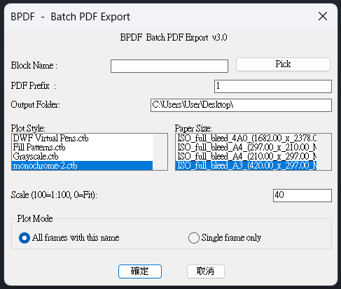

[中文說明](README-zh.md)

# BPDF — AutoCAD Batch Plot Tool

**Batch export all title block frames to individual PDFs with one command.**

Built for AutoCAD users. No more plotting one sheet at a time.

---

## What it does

- Simple dialog box — fill in settings and click OK
- Click **Pick** to detect Block name automatically by clicking a frame
- Option to plot just that 1 frame, or all frames with the same name
- Sorts output top-to-bottom, left-to-right
- Lets you choose plot style, paper size, and scale
- Remembers your last settings automatically
- Confirmation screen before plotting
- Compatible with AutoCAD 2014 and above (auto-detects version differences)

---

## Demo

```
Command: BPDF
```



26 sheets exported in under 1 minute.

---

## Installation

1. Download `batch-pdf.lsp`
2. In AutoCAD, type `APPLOAD`
3. Click **Startup Suite → Contents → Add**
4. Select `batch-pdf.lsp` → OK

The command `BPDF` will be available every time AutoCAD starts.

**Recommended file location:**
```
C:\Users\YourName\AppData\Roaming\Autodesk\AutoCAD 2022\R24.1\enu\Support
```

Not sure where? Type `(findfile "acad.lsp")` in AutoCAD to find the Support folder.

---

## Usage

**Step 1 — Run the command**
```
BPDF
```

**Step 2 — Fill in the dialog**

| Field | Description |
|-------|-------------|
| Block Name | Type the block name, or click **Pick** to click directly on a frame |
| PDF Prefix | Output filename prefix e.g. `Project-2024` → `Project-2024_1.pdf` |
| Output Folder | Full path, defaults to Desktop |
| Plot Style | Select from list |
| Paper Size | Select from list (A0–A4) |
| Scale | `100` = 1:100, `0` or `F` = Fit to paper, Enter = last setting |
| Plot Mode | All frames with this name, or single frame only |

**Step 3 — Click OK and confirm**

Review summary → `Y` → done!

---

## Requirements

- AutoCAD 2014 or above
- Windows 10 / 11
- `DWG To PDF.pc3` plotter (included with AutoCAD by default)

---

## Changelog

**v3.0** - DCL dialog box interface, Pick button to select title block, single/all frame option, scale supports 0 or F for Fit
**v2.0** - Click to select title block, single/all frame option, cross-version fixes
**v1.1** - Auto-detect AC_WINDOW value, fixed RefreshPlotDeviceInfo order
**v1.0** - Initial release

---

## Why BPDF?

AutoCAD's built-in Batch Plot works at the Layout level.
BPDF works in **Model Space** — common workflow in Taiwan and Asia where all drawings are arranged in one Model Space with individual title block frames.

Similar tools exist in Chinese-language communities (e.g. 秋楓 BatchPlot) but are closed-source and Chinese only. BPDF is open source and works globally.

---

## About

Made by an AutoCAD user in Taiwan who got tired of plotting sheets one by one.

If this saved you time, consider buying me a coffee ☕

[](https://ko-fi.com/beastt1992)

---

## License

MIT — free to use, modify, and share.
